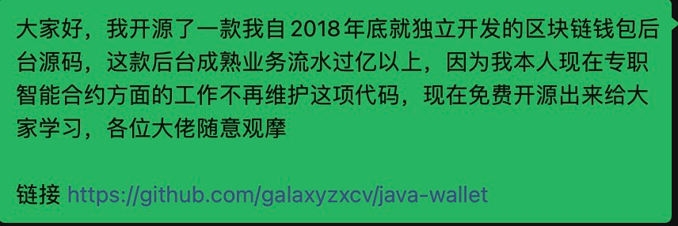

<h1 align="center">
  java-wallet
</h1>

  

  

  

  

  

# 语言选择

- en [English](README.md)
- zh_CN [简体中文](README_zh_CN.md)

# 演示网址
- 后台管理 http://34.152.57.199:10001
  （账号密码请在电报联系我）
- 定时任务管理 http://34.152.57.199:8081/xxl-job-admin
  （账号密码请在电报联系我）

### 区块链java wallet介绍：
- #### 业务后台是依据该数字货币的功能组件所构建出来的更强大的业务系统，可以随时获取不同公链区块链地址,并支持(BTC,OMNI,ETH,ERC20,TRX,TRC20,BCH,BSV,DOGE,DASH,LTC)的充归提功能
注：程序员对接时主要对接api接口就行了
- ###### 代码演示

- ###### 后台管理演示

- ###### API接口演示

#### 全套系统架构情况：
- 使用springboot框架
- 语言为java,kotlin
- 使用rabbitmq消息队列
- mysql云数据库
- xxl-job分布式定时任务框架

#### 全套系统均由我一个人开发，并且已经在生产环境跑了上亿流水，具有充足的可靠性，可扩展性，实用性，可以放心使用。

### 有问题提交issue

## 特别注意

任何使用本源码从事商业活动，对别人和自己造成损失的，本人概不负责！

##中文彩蛋
